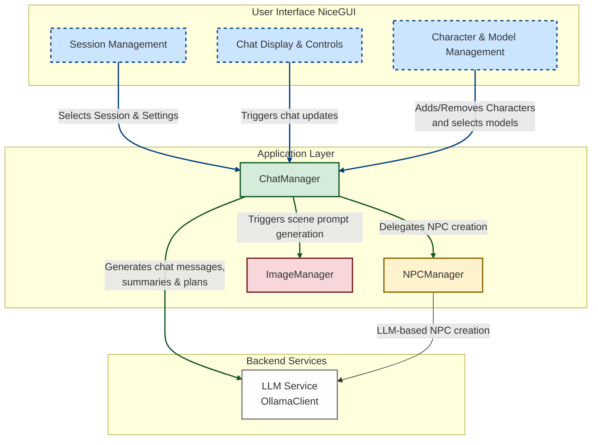

# Multipersona Chat Manager

The **Multipersona Chat Manager** is a conversational application that simulates a multi-character dialogue using large language model (LLM) backends. It supports dynamic character interactions, automatic chat generation, non-player character (NPC) creation, image prompt generation, conversation summarization, and dynamic plan updates for each character—all integrated into a web‐based interface.


|  |  |  |
|--------------------------------------------------------------|--------------------------------------------------------------|--------------------------------------------------------------|

## Overview

This project allows you to:
- **Manage Multiple Characters:** Add and remove characters (both pre-defined “player characters” and dynamically created NPCs) that participate in a conversation.
- **Automatic Chat:** Run an automatic round-robin chat where each character takes a turn generating dialogue, actions, and internal updates using LLM calls.
- **NPC Manager:** Dynamically decide—based on recent conversation context—if a new NPC should be created. If so, generate a new character with a unique name, role, appearance, and location.
- **Image Generation Prompts:** Compose concise scene and character description prompts for external image generation engines. These prompts are built from conversation context and saved to an output folder.
- **Dynamic Character Plans:** Each character maintains a short-term plan (goal plus sequential steps) that is generated and updated via LLM prompts. Plan changes are stored and tracked.
- **Conversation Summarization:** As conversations grow longer, chunks of messages are automatically summarized (and old messages hidden) so that the LLM continues to work efficiently while still retaining context.
- **Dynamic Location & Appearance Updates:** Character locations and appearances are updated by analyzing recent conversation turns using dedicated LLM prompts.

The application uses a SQLite database to persist sessions, messages, summaries, character prompts, and metadata. It also employs [NiceGUI](https://nicegui.io/) to render a modern web interface.



## Repository Structure

```
MultipersonaChatManager/
├── src/
│   └── multipersona_chat_app/
│       ├── chats/                # Chat and conversation management logic
│       ├── db/                   # SQLite database management for sessions, messages, summaries, etc.
│       ├── llm/                  # LLM client (Ollama integration) and inference helpers
│       ├── models/               # Pydantic models for interactions, characters, metadata, etc.
│       ├── npc_manager.py        # Logic for determining and creating NPCs
│       ├── image_manager.py      # Image prompt generation (no LLM call, just prompt composition)
│       ├── templates.py          # Template strings used to form LLM prompts
│       ├── ui/                   # Web-based user interface built with NiceGUI
│       └── utils.py              # Utility functions (e.g., settings loading, Markdown cleaning)
├── output/                      # Output folder for conversation logs, image prompts, and other generated files
├── requirements.txt             # Python dependencies list
└── README.md                    # This file
```

## Installation

1. **Clone the Repository:**

   ```bash
   git clone https://github.com/your-username/multipersona-chat-manager.git
   cd multipersona-chat-manager
   ```

2. **Create and Activate a Virtual Environment (Optional but Recommended):**

   ```bash
   python -m venv venv
   source venv/bin/activate  # On Windows: venv\Scripts\activate
   ```

3. **Install Dependencies:**

   Make sure you have Python 3.7 or later. Then install the required packages:

   ```bash
   pip install -r requirements.txt
   ```

4. **Configure the LLM Backend:**

   This application uses an LLM (via the [Ollama](https://ollama.com/) API by default) to generate dialogue, plans, and summaries. Ensure that your LLM server is running locally (or adjust the configuration files in `src/multipersona_chat_app/config/` accordingly).

## Running the Application

Start the web interface by running the entry point:

```bash
sh ./run.sh
```

By default, the NiceGUI server will start on port 8080. Open your web browser and go to:

```
http://localhost:8080
```

## Using the Web Interface

The web interface is divided into two main panels:

### Sidebar (Left Panel)
- **Session & Model Settings:**
  - **Session Management:**  
    - Create a new session, delete the current session, or switch between sessions.
  - **Model Selection:**  
    - Choose from a list of available local LLM models and refresh the list.
  - **Setting Selection:**  
    - Select a “setting” which provides background details (e.g., environment description, start location) for the conversation.
- **Toggles:**
  - **Automatic Chat:**  
    - Enable automatic round-robin conversation where characters generate messages automatically.
  - **NPC Manager Active:**  
    - When enabled, the system periodically checks whether a new NPC should be added based on conversation context.
  - **Show Private Info:**  
    - Toggle the display of internal details such as emotions, thoughts, and character plans.
- **Character Management:**
  - **Add Character:**  
    - Choose from a dropdown of available characters to add to the current session.
  - **Display & Remove Characters:**  
    - View all added characters and remove any unwanted ones.
- **Additional Actions:**
  - **Update All Character Info:**  
    - Forces a recalculation of all characters’ location and appearance based on the latest conversation.
  - **Generate Scene Prompt:**  
    - Generate and save image generation prompts based on the current scene and characters.

### Main Chat Area (Right Panel)
- **Conversation Display:**
  - Shows the conversation messages in order. Each message displays the speaker’s name (with an appended role for NPCs), a timestamp, and the message content.
  - If “Show Private Info” is enabled, internal details like emotions and thoughts will also be shown.
  
## Detailed Functionality

### NPC Manager

- **What It Does:**  
  Determines whether a new NPC (non-player character) is needed based on the most recent conversation lines and current character roster.

- **How It Works:**  
  - The `NPCManager` class collects recent dialogue and known characters from the session.
  - It uses specialized system and user prompts (see `NPC_CREATION_SYSTEM_PROMPT` and `NPC_CREATION_USER_PROMPT` in the code) to query the LLM (via the `OllamaClient`).
  - If the LLM indicates that a new NPC is required, it creates a new character with generated attributes (name, role, appearance, and location) and adds it to the session (both as a character and as metadata in the database).

- **Usage:**  
  Simply toggle the **NPC Manager Active** switch in the sidebar. The system will then handle NPC creation automatically during the conversation.

### Image Generation Prompts

- **What It Does:**  
  Constructs concise, descriptive prompts that can be used by external image-generation engines to create visuals of the scene or characters.

- **How It Works:**  
  - The `ImageManager` class loads a set of template strings and configuration data (from a YAML file) that describe how to structure the prompt.
  - It fills in these templates with details such as the current setting, moral guidelines, non-NPC character details, recent dialogue, and previous summaries.
  - Instead of making an LLM call, the composed prompts are saved as text files (e.g., `system_prompt.txt` and `user_prompt.txt`) in the `output/image_prompts` folder.

- **Usage:**  
  Click the **Generate Scene Prompt** button in the sidebar to produce the image generation prompts.

### Automatic Chat Functionality

- **What It Does:**  
  Automates the conversation flow by selecting the next speaker (in a round-robin manner) and generating their message using LLM calls.

- **How It Works:**  
  - When **Automatic Chat** is enabled, a timer triggers periodic calls to the `automatic_conversation()` function.
  - The `ChatManager` selects the next speaker (skipping NPCs that do not meet certain conditions) and uses their dynamic prompt template—filled with the latest dialogue, summaries, location, and appearance—to generate a new message.
  - The generated message may include dialogue, an action (displayed in italics), and internal state (emotions, thoughts) if the **Show Private Info** toggle is active.
  - After a message is generated, the system may also trigger location or appearance update evaluations if indicated by the generated output.

- **Usage:**  
  Enable the **Automatic Chat** toggle to have characters generate messages automatically at fixed intervals.

### Character Plans

- **What It Does:**  
  Each character maintains a “plan” that includes a clear goal and a few actionable steps. The plan guides the character’s behavior and may change over time.

- **How It Works:**  
  - The `ChatManager` uses dedicated LLM prompts (e.g., `PLAN_UPDATE_SYSTEM_PROMPT` and `PLAN_UPDATE_USER_PROMPT`) to generate or update a character’s plan.
  - Plans are stored in the database and a history of changes is maintained.
  - If the generated plan is too short or too different, the system retries the LLM call with additional context (such as explaining that the character is alone or with others).

- **Usage:**  
  Plans are updated automatically as part of the conversation. If you enable **Show Private Info**, the current goal and steps will be visible in the character details pane.

### Conversation Summarization

- **What It Does:**  
  Summarizes older parts of the conversation to keep the active dialogue concise while still retaining context for later turns.

- **How It Works:**  
  - When the number of visible messages for a character reaches a preset threshold, a block of messages is selected and sent to the LLM via the `SUMMARIZE_PROMPT`.
  - The resulting summary is stored in the database and the summarized messages are hidden from the conversation view.
  - In addition, when enough summaries have accumulated, the system combines them into a single, cohesive summary using a combined summary prompt.

- **Usage:**  
  This functionality runs automatically based on thresholds defined in the configuration.

### Dynamic Location & Appearance Updates

- **What It Does:**  
  Evaluates whether a character’s location or appearance has changed based on recent conversation events and updates the database accordingly.

- **How It Works:**  
  - Specialized LLM prompts (for example, `LOCATION_UPDATE_SYSTEM_PROMPT` and `APPEARANCE_UPDATE_SYSTEM_PROMPT`) are used to analyze the recent dialogue and determine if a character should be shown in a new location or with an updated appearance.
  - If changes are detected, the new information is saved to the database and a small “transition action” message may be generated.

- **Usage:**  
  These updates are automatically triggered during conversation turns or when the “Update All Character Info” button is pressed.

## Configuration

All configuration files are found in the `src/multipersona_chat_app/config/` directory. You can adjust:
- LLM parameters (model names, API URLs, temperature, timeouts)
- Chat settings (summarization thresholds, auto chat interval, plan retry amounts)
- Image generation prompt templates
- Moral guidelines and other stylistic instructions

## Troubleshooting

- **LLM Integration:**  
  If you receive errors related to LLM calls (e.g., no response or malformed output), verify that your Ollama (or other LLM backend) is running and that the API endpoints in the configuration files are correct.
  
- **Session Issues:**  
  If a session becomes unresponsive or you need to reset character data, you may delete the SQLite database file in the `output/` folder and start a new session.

- **Dependencies:**  
  Ensure that all required Python packages (listed in `requirements.txt`) are installed and that you are using a supported Python version.

## Contributing

Contributions are welcome! If you’d like to help improve the project—whether by fixing bugs, adding features, or enhancing documentation—please open an issue or submit a pull request.

## License

This project is licensed under the MIT License. See the [LICENSE](LICENSE) file for details.

---

*This README provides a high-level overview and detailed explanation of the Multipersona Chat Manager’s functionality. For more information, consult the inline documentation in the source code.*
